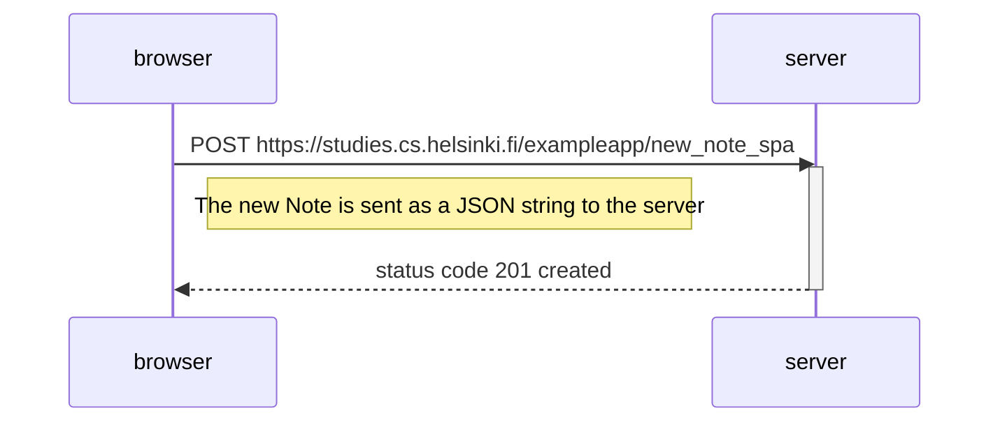

```mermaid
sequenceDiagram
    participant browser
    participant server

    browser->>server: POST https://studies.cs.helsinki.fi/exampleapp/new_note_spa
    activate server
    Note right of browser: The new Note is sent as a JSON string to the server 
    server-->>browser: status code 201 created
    deactivate server
```